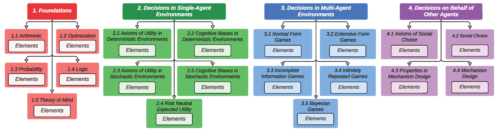

# STEER: Systematic and Tuneable Evaluation of Economic Rationality in LLMs

A multiple-choice question-answering (MCQA) benchmark containing test questions on elements of economic rationality. 

These elements are organized into a four order taxonomy .

This repository contains the code that was used to generate the test questions along with the generated questions themselves. 
 
