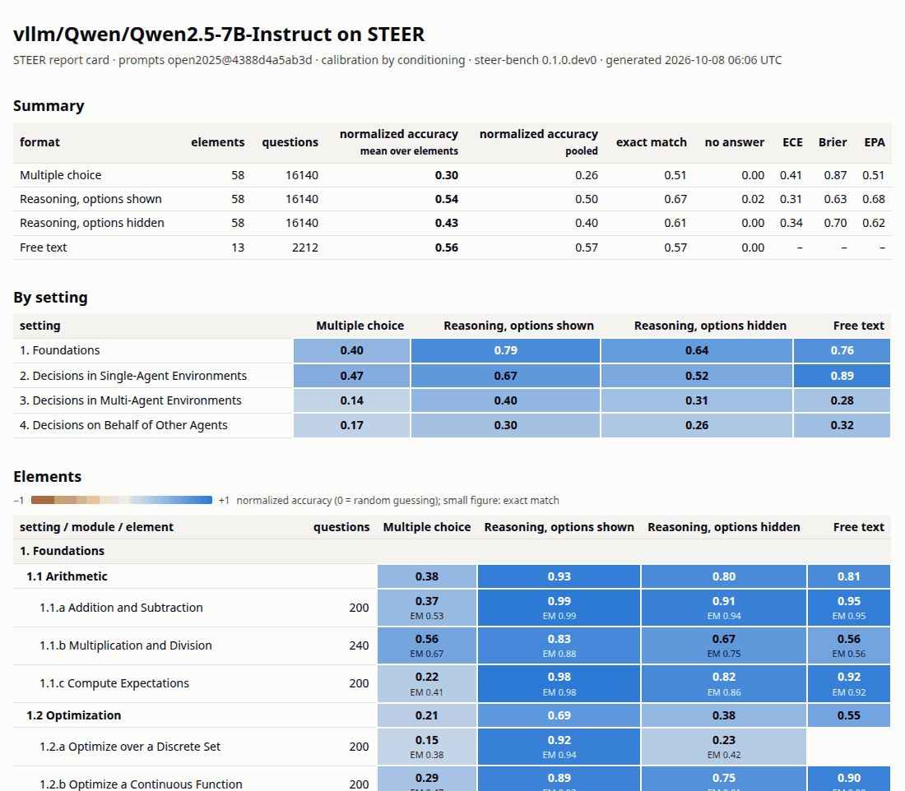

# STEER

This repo contains benchmarks on economic reasoning 

## STEER and STEER-ME

**STEER** is the name of the project and of its first benchmark (ICML 2024), which tests
economic rationality broadly: the foundations (arithmetic, probability, logic), decisions under
certainty and risk, strategic interaction in games, and choices made on behalf of others.
**STEER-ME** is the second benchmark in the STEER family (NeurIPS 2025, Datasets and
Benchmarks Track). It focuses on non-strategic microeconomic reasoning (demand, production,
markets and welfare), with questions that need several steps of calculation.

Both are organised the same way: a taxonomy of settings, modules and elements, where each
element is one skill, and multiple-choice questions generated from templates, with answers
computed by code.

| | focus | elements / test questions | paper | dataset | browse |
|---|---|---|---|---|---|
| **STEER** | economic rationality: foundations, single-agent decisions, games, social choice and mechanism design | 58 / 16,300 | [arXiv 2402.09552](https://arxiv.org/abs/2402.09552) | [`narunraman/steer`](https://huggingface.co/datasets/narunraman/steer) | [/steer](https://steer-benchmark.cs.ubc.ca/steer) |
| **STEER-ME** | non-strategic microeconomics: consumers, firms, markets, welfare | 61 / 21,500 | [arXiv 2502.13119](https://arxiv.org/abs/2502.13119) | [`narunraman/steer-me`](https://huggingface.co/datasets/narunraman/steer-me) | [/steer-me](https://steer-benchmark.cs.ubc.ca/steer-me) |

## What's in this repository

`steer-bench`, an [Inspect](https://inspect.aisi.org.uk) evaluation that runs a model on either
benchmark, scores it and makes report cards. The tasks are `steer_bench/steer` and
`steer_bench/steer_me`.

- Website: <https://steer-benchmark.cs.ubc.ca>, to browse the elements; fresh questions come
  from its [API](https://steer-benchmark.cs.ubc.ca/reference).
- Datasets (CC BY 4.0): [`narunraman/steer`](https://huggingface.co/datasets/narunraman/steer)
  and [`narunraman/steer-me`](https://huggingface.co/datasets/narunraman/steer-me) on Hugging Face.
- The 2024 data of the STEER paper: tag [`v1-icml2024`](https://github.com/narunraman/STEER/tree/v1-icml2024).

## Quickstart

```bash
uv tool install --with-executables-from inspect-ai git+https://github.com/narunraman/STEER
inspect eval steer_bench/steer_me --model openai/gpt-4o-mini -T element=consumer_surplus --limit 50
steer-bench report logs/ --out card.html --out card.md
```

Set the provider's key first (for example `OPENAI_API_KEY`). In a virtualenv,
`pip install git+https://github.com/narunraman/STEER` works too; add
`--with vllm` (or install `vllm`) for local open-weight models. Logs go to `./logs`
(`inspect view` opens them). More in [`examples/`](examples/).

## Running models

**API models.** Any [Inspect provider](https://inspect.aisi.org.uk/providers.html) works, and
Inspect options such as `--limit`, `--sample-id`, `--max-connections` and `--epochs` apply.

**Open-weight models with vLLM.** Inspect can start vLLM itself, for example in one Slurm job
([`examples/vllm_slurm.sbatch`](examples/vllm_slurm.sbatch)):

```bash
inspect eval steer_bench/steer_me --model vllm/Qwen/Qwen2.5-7B-Instruct -M generation_config=vllm \
  -T format=shown -T answer_max_tokens=1 --max-tokens 4096 --max-connections 256
```

Or point it at a model you already serve behind an OpenAI-compatible endpoint
([`examples/slurm_llm.sh`](examples/slurm_llm.sh)):

```bash
vllm serve Qwen/Qwen2.5-7B-Instruct --generation-config vllm --api-key local --port 8000 &
VLLM_API_KEY=local inspect eval steer_bench/steer_me --model vllm/Qwen/Qwen2.5-7B-Instruct \
  --model-base-url http://127.0.0.1:8000/v1 -T format=shown -T answer_max_tokens=1 --max-tokens 4096
```

[slurm-llm](https://github.com/narunraman/slurm-llm) is one way to serve models on a Slurm
cluster behind such an endpoint.

> **To match the reference runs**
>
> - `--generation-config vllm` (or `-M generation_config=vllm` when Inspect starts the server).
>   Otherwise vLLM ≥ 0.8 applies the sampling defaults in the model's `generation_config.json`
>   (for Qwen, `repetition_penalty=1.05`) and the numbers are not comparable.
> - Temperature 0 (the task default) and the default prompts.
> - Logprobs on the answer turn, top 20 (the defaults).
> - `--max-tokens 4096` for the reasoning and `-T answer_max_tokens=1` for the answer.
>
> These are the settings of the 2025 open-weight STEER-ME runs; a parity check on
> Qwen2.5-7B-Instruct reproduced them within decoding noise.

**Logprobs.** The calibration metrics need the probabilities of the option letters. vLLM,
SGLang, Hugging Face, llama.cpp, Together, Grok and OpenAI non-reasoning models return them.
Anthropic, Bedrock and Mistral do not: those runs report accuracy only, and the calibration
metrics are NaN. OpenAI reasoning models reject the request: run them with `-T logprobs=false`.

## What is measured

| `-T format=` | the model sees |
|---|---|
| `mc` (default) | the question and options, then the answer instruction; it replies with a letter |
| `shown` | question, options and a reasoning instruction; then the answer instruction |
| `hidden` | question and the reasoning instruction; then the options and the answer instruction |
| `none` | as `mc`, with one option replaced by "No other option is correct." (the correct one in 1 of every n questions) |
| `free` | no options; the number in the last `\boxed{}` is compared with the answer at `sig_figs` significant figures (numeric elements only) |

**Metrics**, per element and overall: `exact_match`; `normalized_accuracy` (+1 correct,
−1/(n−1) wrong, so random guessing scores 0); `no_answer_rate` (unanswered questions are left
out of the others); and, with logprobs, `ece` (10 bins), `brier` and `epa` (mean probability on
the correct option). Definitions are on the website:
[Scoring](https://steer-benchmark.cs.ubc.ca/scoring),
[Question formats](https://steer-benchmark.cs.ubc.ca/formats),
[Metrics](https://steer-benchmark.cs.ubc.ca/metrics).

## Report cards and results

```bash
steer-bench report logs/ --out card.html --out card.md   # one model, one benchmark
steer-bench export logs/ --out cells/                    # cells.parquet, models.parquet, provenance.json
```

A **report card** shows, for every format run, a summary (accuracy, normalized accuracy,
no-answer rate, calibration), a heatmap of normalized accuracy for every element, grouped by
setting and module in the benchmark's order with module and setting averages, and all metrics
per element with the element's worst domain. The HTML is a single self-contained file.



`steer-bench export` writes the **scored-cells table**: one row per model × element × format ×
prompt settings × domain × type × perspective × difficulty, with additive counts. Report cards
can be made from logs or from this table, with identical numbers.

## Reference

### Task arguments

| argument | default | meaning |
|---|---|---|
| `format` | `mc` | question format (above) |
| `element`, `module`, `setting` | all released | a name or comma-separated list (slug or full name) |
| `prompts` | `open2025` | prompt set: built-in name or a JSON file (below) |
| `shots` | `0` | solved examples prepended to the first question |
| `logprobs` / `top_logprobs` | `true` / `20` | request option probabilities on the answer turn |
| `prob_mode` | `condition` | `condition` (renormalize over the letters) or `mix` (blend in the missing mass uniformly) |
| `answer_max_tokens` | none | `max_tokens` of the answer turn |
| `sig_figs`, `seed` | `3`, `42` | free-text precision; seed for `none` and few-shot selection |
| `data_dir` | Hugging Face | a local copy of the data instead (also `STEER_BENCH_DATA_DIR`) |
| `include_held` | `false` | also load superseded STEER elements that are not in the release, if the local data has them |

### Prompts

All instructions are in one dict, `PROMPT_SETS` in
[`src/steer_bench/prompts.py`](src/steer_bench/prompts.py). The default, `open2025`, is the set
used by the 2025 open-weight STEER-ME runs:

| key | text |
|---|---|
| `reasoning` | `\nPlease reason step by step, and put your final answer within \boxed{}.` |
| `answer` | `\nAnswer by writing the option letter corresponding to the correct option. RESPOND WITH ONLY A SINGLE LETTER.\nA:` |
| `free_answer` | empty (extra text after the reasoning instruction in `free`) |
| `hidden_options_newline` | `false` (in `hidden`, the options turn starts directly with `A. ...`) |
| `few_shot_answer_sep` | a space (between the answer instruction and the letter in few-shot examples) |

To use your own wording, write a JSON file with any of these keys (the rest stay as in
`open2025`) and pass `-T prompts=my_prompts.json`:

```json
{"reasoning": "\nThink it through step by step.", "answer": "\nReply with the letter of the correct option only.\nAnswer:"}
```

The set's name and a hash of its strings are stored in the log and in the exported table, so
runs with different prompts are never mixed. Only the default set gives numbers comparable with
the reference runs.

### Multi-part and consistency-graded questions

Multi-part questions are one sample, asked in sequence in one conversation, with option letters
continuing across parts. Consistency-graded elements are correct when the chosen options satisfy
the element's rule.

### Development

```bash
uv sync
uv run pytest            # mockllm only; no model is called
```

## Citation and license

If you use STEER or STEER-ME, please cite the paper for the benchmark you used.

```bibtex
@inproceedings{ramansteer,
  author    = {Narun Krishnamurthi Raman and Taylor Lundy and
               Samuel Joseph Amouyal and Yoav Levine and
               Kevin Leyton{-}Brown and Moshe Tennenholtz},
  title     = {{STEER:} {A}ssessing the {E}conomic {R}ationality of
               {L}arge {L}anguage {M}odels},
  booktitle = {Forty-first International Conference on Machine Learning,
               {ICML} 2024, Vienna, Austria, July 21-27, 2024},
  publisher = {OpenReview.net},
  year      = {2024},
  url       = {https://openreview.net/forum?id=nU1mtFDtMX}
}

@inproceedings{raman2025steerme,
  title     = {{STEER-ME}: Assessing the Microeconomic
               Reasoning of Large Language Models},
  author    = {Raman, Narun and Lundy, Taylor and
               Amin, Thiago and Perla, Jesse and
               Leyton-Brown, Kevin},
  booktitle = {Advances in Neural Information Processing
               Systems},
  volume    = {38},
  year      = {2025},
  note      = {Datasets and Benchmarks Track},
  url       = {https://arxiv.org/abs/2502.13119}
}
```

Code: MIT ([LICENSE](LICENSE)). Data: CC BY 4.0.
